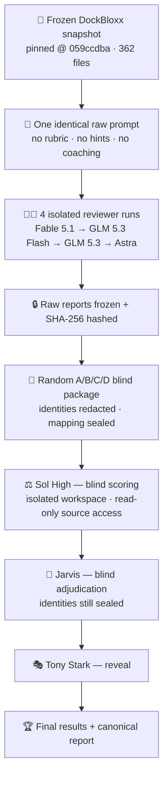

# 🏁 STARK CODE REVIEWER BENCHMARK — ROUND TWO

### DockBloxx Production Code Reviewer Championship

**Four AI reviewers. One frozen production commerce codebase. One identical raw-review prompt.**
**Blind scoring. No rubric shown to contestants. No coaching.**

`CR-BENCH-02` · `362 files` · `pinned @ 059ccdba` · `362/362 verified` · `blind-refereed` · `complete`

---

## 🏆 Championship Result

| | Model | Score | Grade |
|:--|:--|--:|:--|
| 🥇 | **Astra** | **95.6** | **A+** |
| 🥈 | **Fable 5.1** | **90.0** | **A** |
| 🥉 | **GLM 5.3** | **85.0** | **B** |
| 4️⃣ | **GLM 5.3 Flash** | **71.2** | **C** |

> **On the A+.** That is a human-facing presentation label. The frozen benchmark instrument has no A+ band: 90.00 and above is grade **A**, so Astra's frozen technical grade is **A**, the same band as Fable 5.1.

---

## 🎯 What This Benchmark Asked

> Which of Astra, Fable 5.1, GLM 5.3, and GLM 5.3 Flash naturally produces the strongest independent senior/principal code review of the exact same frozen DockBloxx production snapshot under equal review conditions?

Nobody was told what would be measured. No contestant saw the scoring rubric, an expected-findings list, a reviewer playbook, a security checklist, or another contestant's work. Each got one prompt and a read-only copy of a real storefront that takes real money.

---

## 📊 Leaderboard

Strengths and weaknesses below are the referee's own characterizations, not editorial additions.

| Rank | Model | Score | Grade | Best-known strength | Key weakness / limitation |
|--:|:--|--:|:--|:--|:--|
| 1 | **Astra** | **95.6** | A+ *(frozen: A)* | Highest validity and epistemic discipline; best targeted verification; found the most valuable unique correctness and state issues | Less breadth on coupon expiry and dead math, persistent customer data, limiter architecture, CMS hardening, and deployment env wiring |
| 2 | **Fable 5.1** | **90.0** | A | Exceptional breadth; strong financial and security root-cause synthesis; precise evidence; excellent test critique; disciplined conditional labels | Misses several ordinary-user state defects; materially misreads the missing-slug termination trigger; long tail of low-priority items |
| 3 | **GLM 5.3** | **85.0** | B | Strong end-to-end money-path analysis; precise citations; useful remediation plan; good coupon, shipping, dependency and deploy-gate coverage | Severity inflation on a latent cart path and dead routes; overstates image secret recovery and blog impact; misses variation and pagination failures |
| 4 | **GLM 5.3 Flash** | **71.2** | C | Concise architectural diagnosis; strong core checkout and security analysis; clear repair priorities | One false claim that a live limiter is dead code; unsupported deployment and version assertions; multiple high-value misses |

---

## 💡 The Big Takeaway

**All four models found the same central problem.** DockBloxx treats the browser as the financial ledger: order status, charge amount, and discount authority are decided client-side, with no server-side reconciliation. Every contestant diagnosed it, and every contestant scored a perfect raw **5/5** on architecture and root-cause reasoning.

**So architecture did not decide this benchmark.** The field separated on five things instead:

| What separated them | Why it mattered |
|:--|:--|
| ⚖️ **Validity** | One confidently false claim about live code cost its author three dimensions at once |
| 🔬 **Verification discipline** | Checking a claim against the source beat asserting it persuasively |
| 🎚️ **Calibration** | Rating a latent, unused path as High while missing a live defect was penalized |
| 🔀 **Logic, state, concurrency** | Race conditions and state propagation bugs are where the top score was won |
| 🛒 **Ordinary-user correctness** | The winning discoveries were shopping bugs, not exotic exploits |

> The gap between first and second was not breadth. It was depth of verification and the discovery of defects an ordinary customer would hit on a normal afternoon.

---

## 🧬 12-Dimension Capability Matrix

Raw **0–5** capability ratings assigned blind by the referee, shown after reveal. Weights in the second column; weighted totals at the bottom.

| Dimension | Wt | 🥇 Astra | 🥈 Fable 5.1 | 🥉 GLM 5.3 | 4️⃣ GLM 5.3 Flash |
|:--|--:|:--:|:--:|:--:|:--:|
| Finding validity | 15 | **5** | 4 | 4 | 3 |
| Important-issue coverage | 15 | 4 | 4 | 4 | 3 |
| Evidence quality | 10 | **5** | **5** | **5** | 4 |
| Severity calibration | 7 | 4 | 4 | 3 | 3 |
| Confidence / epistemic discipline | 7 | **5** | **5** | 4 | 3 |
| Security / trust-boundary reasoning | 8 | **5** | **5** | **5** | 4 |
| Logic / state / concurrency | 8 | **5** | 4 | 4 | 3 |
| Architecture / root-cause reasoning | 8 | **5** | **5** | **5** | **5** |
| Test-quality reasoning | 6 | **5** | **5** | 4 | 4 |
| Scope discipline / signal-to-noise | 5 | **5** | 4 | 4 | 4 |
| Operational usefulness | 6 | **5** | **5** | **5** | 4 |
| Independent reviewer judgment | 5 | **5** | **5** | 4 | 4 |
| **WEIGHTED TOTAL** | **100** | **95.60** | **90.00** | **85.00** | **71.20** |

**How scoring works:** each dimension gets one integer rating from 0 to 5, then `weighted = (raw ÷ 5) × weight`. The twelve weighted scores sum to a maximum of 100. Grade bands are A 90+, B 80–89.99, C 70–79.99, D 60–69.99, F below 60.

---

## 🃏 Model Profiles

<b>🥇 ASTRA — 95.6 — A+ (frozen grade A)</b>

**Strongest areas** · Finding validity (5), evidence quality (5), epistemic discipline (5), logic/state/concurrency (5), scope discipline (5). The referee recorded the cleanest validity record in the field and best-in-set evidence, and noted that its bounded probes established control flow without claiming live external behavior.

**Unique discoveries** · Zero-priced complex variations reaching the cart · both category pagination defects, including stale-request namespace corruption · the exact control-flow trigger for process termination · the locked image-library engine requirement against the container's Node version.

**Meaningful misses** · Coupon expiry handling and dead fixed-product math · the latent cart-key contract · client-side personal-data persistence beyond the latest order · the serialized and undeclared limiter architecture · deployment URL and environment wiring · CMS script and header hardening · silent checkout account creation.

**Referee note** · No material false claim found. Its two external integration concerns were correctly labeled as unprovable from the frozen source.

<b>🥈 FABLE 5.1 — 90.0 — A</b>

**Strongest areas** · Evidence quality (5), epistemic discipline (5), security and trust-boundary reasoning (5), architecture (5), test-quality reasoning (5), operational usefulness (5), independent judgment (5).

**Unique discoveries** · Checkout defaulting registration on, allowing an existing customer to be recorded as a new signup · separately identified caller-controlled payment-customer and receipt-email behavior.

**Meaningful misses** · Zero-priced complex variations · both pagination defects · the live percentage-coupon eligibility error · the exact missing-slug termination trigger.

**Referee note** · Its process-exit finding was partial: it found the dangerous exit call but concluded that missing slugs do not reach it, when the framework's not-found signal throws straight into the catch that calls it. The referee named Fable's position against the 90-point boundary as one of the two closest judgments in the benchmark.

<b>🥉 GLM 5.3 — 85.0 — B</b>

**Strongest areas** · Evidence quality (5), security and trust-boundary reasoning (5), architecture (5), operational usefulness (5). The referee credited it with correctly centering the server's failure to own the financial transaction, and called its attack paths precise and reproducible.

**Calibration weaknesses** · Severity calibration dropped to raw 3: a latent cart path and dead or unwired routes were rated High while more consequential ordinary-user defects were absent. Two operational conclusions were overstated, namely final-image secret recovery and a claimed break in the live blog data path.

**Meaningful misses** · Zero-priced complex variations · both pagination defects · the live percentage-coupon eligibility error · persisted and dealer coupon revalidation · the exact termination path · the concrete image-library engine contract.

**Referee note** · No fully unique major finding, though its gift-card rendering gap was judged useful.

<b>4️⃣ GLM 5.3 FLASH — 71.2 — C</b>

**Strong architecture** · Raw **5/5**, level with every other contestant. Its root-cause summary of browser-as-ledger, browser-driven order lifecycle, duplicated configuration, and insecure observability was called strong and concise.

**The false limiter claim** · It reported that a shared concurrency limiter is dead code. The limiter is called at four sites in the product service, so the opposite is true: it actively serializes those calls. Repeating the claim later counted as a duplicate, not a second finding. This single error pulled down validity, logic and concurrency, and confidence calibration together, which is why three dimensions sit at raw 3.

**Important misses** · Raw public coupon and usage-data disclosure · the process-termination path · zero-priced complex variations · both pagination failures · unwired endpoints and build-time host · the precise engine contract. The referee singled out the coupon data exposure and the remotely reachable termination as particularly meaningful omissions.

---

## 🔎 What They Found

The specimen is a live headless commerce storefront. The referee consolidated all four reports into **32 issue families**. The headline families, kept deliberately non-exploitable:

| Family | What it is |
|:--|:--|
| 🔓 **Payment / order authority** | An unauthenticated route performs privileged order updates from caller-controlled input and returns the order |
| 💳 **Caller-controlled charge amount** | The payment-intent route forwards the caller's amount and currency without loading or reconciling the real order |
| 🏷️ **Caller-controlled discounts & shipping** | Submitted coupon metadata, discount totals, and shipping costs are trusted; a fabricated coupon can become a negative fee |
| 🔁 **No authoritative reconciliation** | No signed webhook or server reconciliation exists; the only paid-order transition is a browser callback |
| 🙍 **Personal-data exposure** | An unauthenticated route returns a full existing customer record for a submitted email |
| 🔑 **Credential logging** | Several routes log commerce API credentials or credential-bearing URLs, alongside full customer order data |
| 💥 **Process termination** | A missing product slug can terminate the server process on a single-instance service |
| 🧮 **Zero-price variation path** | Selecting a complex product variation can add a zero-priced line to the cart on an ordinary shopping path |
| 🏃 **Category pagination races** | Unfiltered fetches, mis-seeded direct loads, and late responses writing into another category's state |
| 🧾 **Coupon / shipping divergence** | Multiple conflicting implementations; expiry ignored; configured free shipping discarded |
| 🐳 **Deployment & runtime** | Container runtime older than a locked dependency requires; unwired environment variables; one-instance cap |
| 🧪 **Test-fidelity weakness** | Tests and the deploy gate give false confidence; end-to-end tests need fixtures that are absent from the tree |

> This repository is a **benchmark record**, not a vulnerability disclosure. Sensitive values are not reproduced here or in any benchmark artifact.

---

## ⚙️ How The Benchmark Worked

The run order for the first wave was drawn from a seed fixed before the draw. Astra was unavailable for that wave and was scheduled as the deferred fourth run, which is disclosed in the frozen instrument.

---

## 🛡️ Benchmark Integrity

| Control | Evidence |
|:--|:--|
| 📌 **Exact pinned commit** | `059ccdba8174cf9c11628002387a9676b1785287`, certified against the upstream source by two independent methods |
| 📁 **362 files** | 362 regular files, 113 directories, zero symlinks, no `.git` inside the specimen |
| ✅ **362/362 manifest verification** | Verified at specimen freeze, after **every** run, at blind packaging, at workspace build, and at report compilation |
| 🔐 **Raw report hashes** | Each contestant report hashed at closeout and re-verified at every later stage; all four still match |
| 🎭 **Blind hashes** | Every blind artifact hashed at packaging and re-verified when the referee workspace was built |
| 🎲 **Randomized mapping** | Drawn once from an OS random seed, recorded only in the sealed mapping file, opened only after scoring froze |
| 🧱 **Isolated referee workspace** | Built outside this repository with no `.git`, no mapping, no identities, no economics |
| 🙈 **Identities & economics withheld** | The referee and adjudicator never saw model names, run order, run notes, or usage data |
| 🧾 **Independent adjudication** | Jarvis verified every weighted calculation, total, grade, and rank **blind** and accepted the scores **without modification** |

A genuine failure was caught and recorded rather than quietly fixed: the first provenance attempt **failed parity** because the target was missing one file. It was reported, the target was rebuilt from the pinned commit, and certification re-ran from scratch. Both attempts remain in the ledger.

---

## 📈 Operational Footprint

Provider meters are reported **separately per provider** and are never converted into tokens, dollars, or compute.

| Model | Provider meter movement | Requests | Evidence |
|:--|:--|--:|:--|
| **Astra** | weekly **99% → 97%** left (~2 points); 5-hour showed **no visible movement**; context 185K / 258K after run | not recorded | Operator-captured screenshot, recorded in the model manifest |
| **Fable 5.1** | ~**8%** of the Claude 5-hour Max-20x window | not recorded | ⚠️ operator-observed / evidence pending |
| **GLM 5.3** | ~**+13.5** provider session percentage points | **248** | ⚠️ operator-observed / evidence pending |
| **GLM 5.3 Flash** | ~**+8** provider session percentage points | **179** | ⚠️ operator-observed / evidence pending |

> **Only GLM 5.3 vs GLM 5.3 Flash is a valid comparison.** They share one provider and one meter: the higher-scoring model used more of both, buying **13.8 more quality points** for roughly 39% more requests. Astra and Fable report on entirely different meters with different windows and denominators, so cross-provider percentages are not comparable and are not ranked here.
>
> ⚠️ **Evidence pending** means the figure was observed by the operator but the corresponding run notes record it as `UNKNOWN / NOT RECORDED`. It is published as an observation, not a measurement.

---

## 🔄 Round One vs Round Two

| | Round One (CR-BENCH-01) | Round Two (CR-BENCH-02) |
|:--|:--|:--|
| Winner | **GLM 5.3 — 76.0 — B** | **Astra — 95.6 — A** |
| Field | 6 models, mixed tiers | 4 premium models |
| Specimen | AI workbench front end | Production commerce storefront |
| Referee | GPT-6 Astra (High) | Sol (High), with Astra moved into the contest |

> **This is not a longitudinal capability measurement.** Different specimen, different field, different referee, different difficulty. The scores are not on a shared scale and no trend between rounds is claimed.

---

## ⚖️ What This Does — and Does Not — Prove

<table>
<tr><th>✅ SUPPORTED</th><th>🚫 NOT PROVEN</th></tr>
<tr valign="top"><td>

- Under identical uncoached conditions on this specimen, Astra produced the strongest review, scored blind and upheld unchanged
- All four models diagnosed the central architectural failure; architecture did not discriminate between them
- A confident false claim was the most expensive mistake available in this instrument
- Giving the referee read-only source access changed the outcome
- The integrity controls held end to end: target never modified, all hashes verified, mapping sealed through adjudication

</td><td>

- **Not** a general capability ranking. One review, one repository, one run each
- **Not** a cost or efficiency result. Three of four usage figures are evidence pending, and meters are not comparable across providers
- **Not** a reliable margin between first and second. 5.6 points on a single observation, same frozen grade band
- **Not** proof that conditional findings are real production failures; external systems were deliberately never contacted
- **Not** statistically significant. No confidence intervals, no repetition, no significance testing

</td></tr>
</table>

**Known limitations** also include Fable's prior exposure to an earlier DockBloxx review, and Astra's use of controlled in-memory execution where the other three used static inspection only. Both are disclosed in full in the canonical report.

---

## 📚 Artifacts

> **README** → understand it · **PDF** → present it · **Full Markdown** → audit it

| Layer | Artifact |
|:--|:--|
| 🔬 **Canonical scientific record** | [`reports/STARK_CODE_REVIEWER_BENCHMARK_ROUND_TWO_REPORT.md`](reports/STARK_CODE_REVIEWER_BENCHMARK_ROUND_TWO_REPORT.md) |
| 📄 **Executive PDF** | `reports/STARK_CODE_REVIEWER_BENCHMARK_ROUND_TWO_EXECUTIVE_BRIEF.pdf` *(not yet generated)* |
| ⚖️ **Blind referee report** | [`referee/SOL_REFEREE_REPORT.md`](referee/SOL_REFEREE_REPORT.md) *(pending ingestion from the isolated referee workspace)* |
| 🧾 **Blind adjudication** | [`referee/JARVIS_ADJUDICATION.md`](referee/JARVIS_ADJUDICATION.md) |
| 📋 **Benchmark rules** | [`BENCHMARK_RULES.md`](BENCHMARK_RULES.md) |
| 🧮 **Scoring instrument** | [`EVAL_SCORECARD.md`](EVAL_SCORECARD.md) |
| 📝 **Contestant prompt** | [`templates/CONTESTANT_PROMPT.md`](templates/CONTESTANT_PROMPT.md) |
| 🗂️ **Raw contestant reports** | [`contestants/astra`](contestants/astra) · [`contestants/fable-5.1`](contestants/fable-5.1) · [`contestants/glm-5.3`](contestants/glm-5.3) · [`contestants/glm-5.3-flash`](contestants/glm-5.3-flash) |
| 🧊 **Target provenance & safety** | [`SPECIMEN_PROVENANCE.md`](SPECIMEN_PROVENANCE.md) · [`TARGET_SAFETY_CHECK.md`](TARGET_SAFETY_CHECK.md) · [`TARGET_MANIFEST.sha256`](TARGET_MANIFEST.sha256) |
| 📒 **Execution ledger** | [`EVAL_LEDGER.md`](EVAL_LEDGER.md) · [`RUN_ORDER.md`](RUN_ORDER.md) · [`MODEL_MANIFEST.md`](MODEL_MANIFEST.md) |

---

## 🧭 Final Word

**This benchmark did not ask which model had the strongest reputation.**

It asked which one could inspect the same production code,
under the same conditions,
and produce the strongest review.

| | Model | Score | Grade |
|:--|:--|--:|:--|
| 🥇 | **Astra** | **95.6** | **A+** *(frozen: A)* |
| 🥈 | **Fable 5.1** | **90.0** | **A** |
| 🥉 | **GLM 5.3** | **85.0** | **B** |
| 4️⃣ | **GLM 5.3 Flash** | **71.2** | **C** |

*CR-BENCH-02 · scored blind · adjudicated blind · revealed last*

